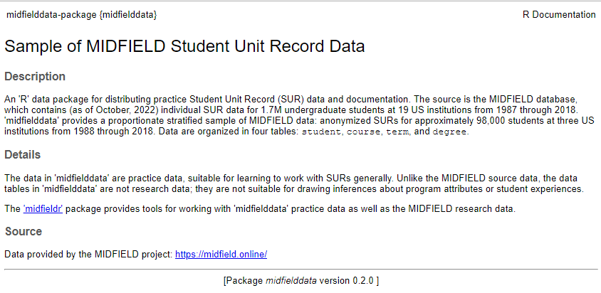

<!-- README.md is generated from README.Rmd. Please edit that file -->

# midfielddata

Sample of MIDFIELD Student Unit Record Data

<!-- badges: start -->

[](https://creativecommons.org/publicdomain/zero/1.0/)
<!-- badges: end -->

Provides a sample of registrar’s data from the MIDFIELD database.
Suitable for practice working with undergraduate, longitudinal Student
Unit Records (SURs).

## Overview

[**MIDFIELD**](https://midfield.online) is a database containing (as of
October, 2022) individual SUR data for 1.7M undergraduate students at 19
US institutions from 1987 through 2018. Access to the MIDFIELD research
database is currently limited to MIDFIELD partner institutions. However,
a sample of the data are accessible via the ‘midfielddata’ R package.

[**midfieldr**](https://midfieldr.github.io/midfieldr/) is an ‘R’
package that provides tools for working with MIDFIELD research data and
with ‘midfielddata’ practice data.

**midfielddata** is an ‘R’ data package providing practice data and
documentation of anonymized SURs for approximately 98,000 students at
three US institutions from 1988 through 2018 organized in four tables:
`course`, `term`, `student`, and `degree.` These data are a
proportionate stratified sample of the MIDFIELD database. The practice
data are characterized in Table 1.

<table class=" lightable-paper" style="font-family: &quot;Arial Narrow&quot;, arial, helvetica, sans-serif; margin-left: auto; margin-right: auto;">
<caption>
Table 1: Attributes of the practice data tables in midfielddata
</caption>
<thead>
<tr>
<th style="text-align:left;background-color: #c7eae5 !important;">
Practice data table
</th>
<th style="text-align:left;background-color: #c7eae5 !important;">
Each row is
</th>
<th style="text-align:right;background-color: #c7eae5 !important;">
No. of rows
</th>
<th style="text-align:right;background-color: #c7eae5 !important;">
No. of columns
</th>
<th style="text-align:right;background-color: #c7eae5 !important;">
Memory
</th>
</tr>
</thead>
<tbody>
<tr>
<td style="text-align:left;font-family: monospace;color: black !important;background-color: white !important;">
course
</td>
<td style="text-align:left;color: black !important;background-color: white !important;">
a student in a course
</td>
<td style="text-align:right;color: black !important;background-color: white !important;">
3,289,532
</td>
<td style="text-align:right;color: black !important;background-color: white !important;">
12
</td>
<td style="text-align:right;">
324 Mb
</td>
</tr>
<tr>
<td style="text-align:left;font-family: monospace;color: black !important;background-color: white !important;">
term
</td>
<td style="text-align:left;color: black !important;background-color: white !important;">
a student in a term
</td>
<td style="text-align:right;color: black !important;background-color: white !important;">
639,915
</td>
<td style="text-align:right;color: black !important;background-color: white !important;">
13
</td>
<td style="text-align:right;">
73 Mb
</td>
</tr>
<tr>
<td style="text-align:left;font-family: monospace;color: black !important;background-color: white !important;">
student
</td>
<td style="text-align:left;color: black !important;background-color: white !important;">
a degree-seeking student
</td>
<td style="text-align:right;color: black !important;background-color: white !important;">
97,555
</td>
<td style="text-align:right;color: black !important;background-color: white !important;">
13
</td>
<td style="text-align:right;">
18 Mb
</td>
</tr>
<tr>
<td style="text-align:left;font-family: monospace;color: black !important;background-color: white !important;">
degree
</td>
<td style="text-align:left;color: black !important;background-color: white !important;">
a student who graduates
</td>
<td style="text-align:right;color: black !important;background-color: white !important;">
49,543
</td>
<td style="text-align:right;color: black !important;background-color: white !important;">
5
</td>
<td style="text-align:right;">
5 Mb
</td>
</tr>
</tbody>
</table>

All data tables are keyed by student ID. The `course` table has multiple
observations (rows) per student with one observation per student per
course per term. The `term` table also has multiple rows per student,
with one observation per student per term. The `degree` table has one
observation per student per degree and the `student` table has one
observation per student.

The data in ‘midfielddata’ are practice data, suitable for learning to
work with Student Unit Records (SURs) generally. Unlike the MIDFIELD
research database, the data tables in ‘midfielddata’ are not research
data; they are not suitable for drawing inferences about program
attributes or student experiences.

## Usage

``` r
# Load the package
library("midfielddata")

# Load individual data tables as needed
data(student, package = "midfielddata")
data(term, package = "midfielddata")
data(course, package = "midfielddata")
data(degree, package = "midfielddata")

# Alternatively, load several tables with one line
data(student, term, degree, package = "midfielddata")
```

## Requirements

- [R](https://www.r-project.org/) (\>= 3.5.0)

## Installation

Because of the size of the data tables, installing midfielddata takes
time; please be patient and wait for the prompt “\>” to reappear. In the
Console, run:

``` r
# Type in the Console
install.packages("midfielddata",
  repos = "https://MIDFIELDR.github.io/drat/",
  type = "source"
)
# be patient
```

You can confirm a successful installation by running the following lines
to bring up the package help page in the Help window.

``` r
# Confirm successful installation
library("midfielddata")
help("midfielddata-package")
```



## Build

‘midfielddata’ currently passes R CMD check with the results shown
below. As a general rule, CRAN expects packages to not exceed 5 Mb,
hence the “note” below.

``` default
0 errors | 0 warnings | 1 note 

NOTE  installed size is 24.3Mb
      sub-directories of 1Mb or more:
      data 23.9Mb

R CMD check succeeded  
```

## Contributing

- Because this is a data package, contributions would not generally be
  expected. However, bug reports and feedback are welcome via the GitHub
  [Issues](https://github.com/MIDFIELDR/midfielddata/issues) page.

- Participation in this open source project is subject to a [Code of
  Conduct](CONDUCT.html).

## Acknowledgments

This work is supported by grants from the US National Science Foundation
(EEC 1545667).

## License

[](https://creativecommons.org/publicdomain/zero/1.0/)

‘midfielddata’, written in 2018–2023 by Richard Layton, Russell Long,
Matthew Ohland, Marisa Orr, and Susan Long, is licensed under CC0 1.0
[(CC0
summary)](https://creativecommons.org/publicdomain/zero/1.0/legalcode)
[(CC0 full license)](LICENSE.html).

To the extent possible under law, the authors have dedicated all
copyright and related and neighboring rights to this software to the
public domain worldwide. This software is distributed without any
warranty.
