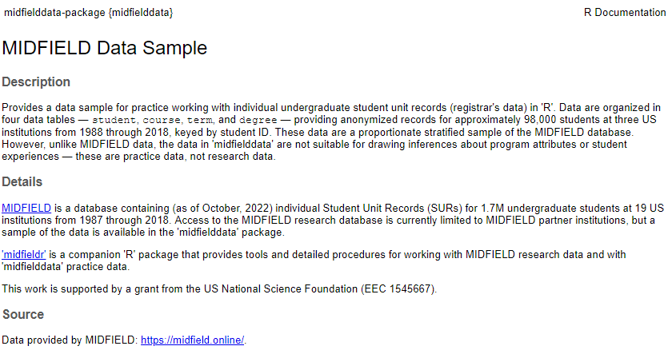

<!-- README.md is generated from README.Rmd. Please edit that file -->

# midfielddata

A sample of the MIDFIELD student unit record data

<!-- badges: start -->

[](https://creativecommons.org/publicdomain/zero/1.0/)
<!-- badges: end -->

The goal of *midfielddata* is to provide a proportionate stratified
sample of MIDFIELD data for practice working with longitudinal,
de-identified, individual student unit records from multiple US
institutions.

## Background

[MIDFIELD](https://engineering.purdue.edu/MIDFIELD) (as of May 2021)
contains individual Student Unit Record (SUR) data for 1.7M unique
students at 33 US institutions. MIDFIELD is large enough to permit
grouping and summarizing by multiple characteristics, enabling
researchers to examine student characteristics (race/ethnicity, sex,
prior achievement) and curricular pathways (including coursework and
major) by institution and over time.

*midfielddata* provides a sample of these data (for practice) with
longitudinal SURs for nearly 98,000 undergraduates at 12 institutions
from 1987–2016 organized in four data tables:

| Data table                                                                   | Each row is              |  N rows | N columns |
|:-----------------------------------------------------------------------------|:-------------------------|--------:|----------:|
| [`student`](https://midfieldr.github.io/midfielddata/reference/student.html) | a degree-seeking student |  97,640 |        13 |
| [`course`](https://midfieldr.github.io/midfielddata/reference/course.html)   | a student in a course    |    3.5M |        12 |
| [`term`](https://midfieldr.github.io/midfielddata/reference/term.html)       | a student in a term      | 728,000 |        13 |
| [`degree`](https://midfieldr.github.io/midfielddata/reference/degree.html)   | a student who graduates  |  48,000 |         5 |

Data tables in `midfielddata`

<br>

## Usage

``` r
# packages used 
library("midfielddata")

# Load the individual data tables as needed
data(student)
data(term)
data(course)
data(degree)


# Alternatively, load several tables with one line
data(student, term, degree)
```

-   Each data set has a `data.table` structure.
-   [*midfieldr*](https://midfieldr.github.io/midfieldr) provides tools
    for working these data.

## Requirements

-   [R](https://www.r-project.org/) (>= 3.5.0)
-   [*data.table*](https://rdatatable.gitlab.io/data.table/)
    Recommended, not required.

## Installation

Because of the size of the data tables, installing the *midfielddata*
takes time; please be patient and wait for the prompt “\>” to reappear.
In the Console, run:

``` r
# install midfielddata  
install.packages("midfielddata", 
                 repos = "https://MIDFIELDR.github.io/drat/", 
                 type = "source")
# be patient
```

You can confirm a successful installation by running the following lines
to bring up the package help page in the Help window.

``` r
library("midfielddata")
help("midfielddata-package")
```



## Build

*midfielddata* currently passes R CMD check with the results:

    0 errors v | 0 warnings v | 1 note x

    NOTE installed size is 18.5Mb
         sub-directories of 1Mb or more: data  18.4Mb

    R CMD check succeeded  

## Contributing

-   As a data package, contributions are not expected.
-   Please use the GitHub
    [Issues](https://github.com/MIDFIELDR/midfielddata/issues) page to
    report bugs or provide feedback.
-   Participation in this open source project is subject to a [Code of
    Conduct](CONDUCT.html).

## Related work

-   [*midfieldr*](https://midfieldr.github.io/midfieldr/) Tools for
    studying MIDFIELD student unit record data in R.
-   [MIDFIELD](https://engineering.purdue.edu/MIDFIELD) A partnership of
    US institutions.
-   [MIDFIELD
    workshops](https://midfieldr.github.io/2021-asee-workshop/) for
    additional information and tutorials.

## Acknowledgments

This work is supported by a grant from the US National Science
Foundation (EEC 1545667).

## License

*midfielddata* is licensed under [CC0
1.0](https://creativecommons.org/publicdomain/zero/1.0/legalcode)
